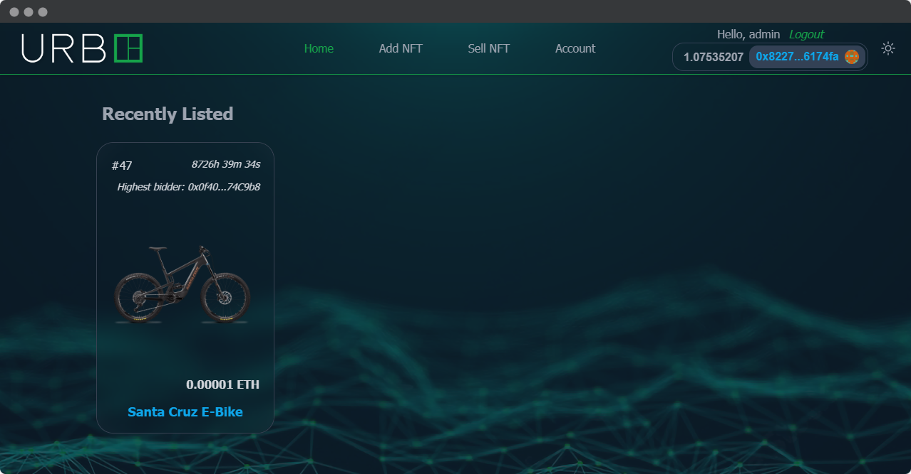

<h1 align="center">
    UrbE Auction
</h1>

<br/>

<p align="center">

</a>
</p>

<br/>

This project is a web application for a charity auction organized by UrbE, a micromobility company. 
The repo in question is the part of the project that uses The Graph, a decentralized protocol for querying data from blockchain networks.

In this project, The Graph is used to query data from the blockchain network. This data includes information about the current highest bidder, the current highest bid amount, and the time remaining in the auction. This information is then displayed on the auction website to allow bidders to make informed decisions.

Using The Graph in this way allows for a more efficient and streamlined way of accessing blockchain data, as well as providing a more reliable source of data than relying on centralized servers.

<hr/>
 
## 🛠️&nbsp; How to run

1. Install Subgraph CLI

   ```
   yarn global add @graphprotocol/graph-cli
   ```

2. Log into [the graph UI](https://thegraph.com/studio/subgraph) and create a new Subgraph.

   Use Goerli as the network.

3. Initialize Subgraph

   ```
   graph init --studio urbe-auction
   ```

4. Authenticate CLI

   ```
   graph auth  --studio YOUR_DEPLOY_KEY_HERE
   ```

5. Update your `subgraph.yaml`

   - Update the `address` with your UrbEAuction Address
   - Update the `startBlock` with the block right before your contract was deployed

6. Build graph locally

   ```
   graph codegen && graph build
   ```

   - `graph codegen`: Generates code in the `generated` folder based on your `schema.graphql`
   - `graph build`: Generates the build that will be uploaded to the graph

7. Deploy subgraph

   Replace `VERSION_NUMBER_HERE` with a version number like `0.0.1`.

   ```
   graph deploy --studio urbe-auction -l VERSION_NUMBER_HERE
   ```

8. View your UI

   Back in your hardhat project, mint and list an NFT with:

   ```
   yarn hardhat run scripts/mint-and-list.js --network goerli
   ```

## 🏴‍☠️&nbsp; Other Parts

You can find the Hardhat part in [this repository](https://github.com/Meno96/urbe-auction-hardhat.git),

the Django part in [this repository](https://github.com/Meno96/urbe-auction-django.git)

and the NextJS part in [this repository](https://github.com/Meno96/urbe-auction-nextjs.git)

## 📫&nbsp; Have a question? Want to chat?

[LinkedIn](https://www.linkedin.com/in/daniele-menin/)

[Instagram](https://www.instagram.com/danielemeno96/)
